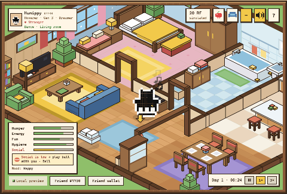
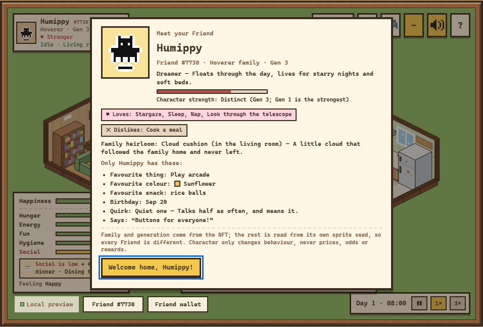
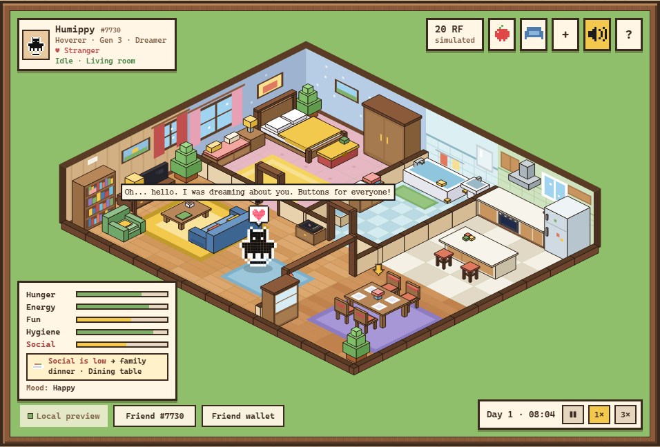
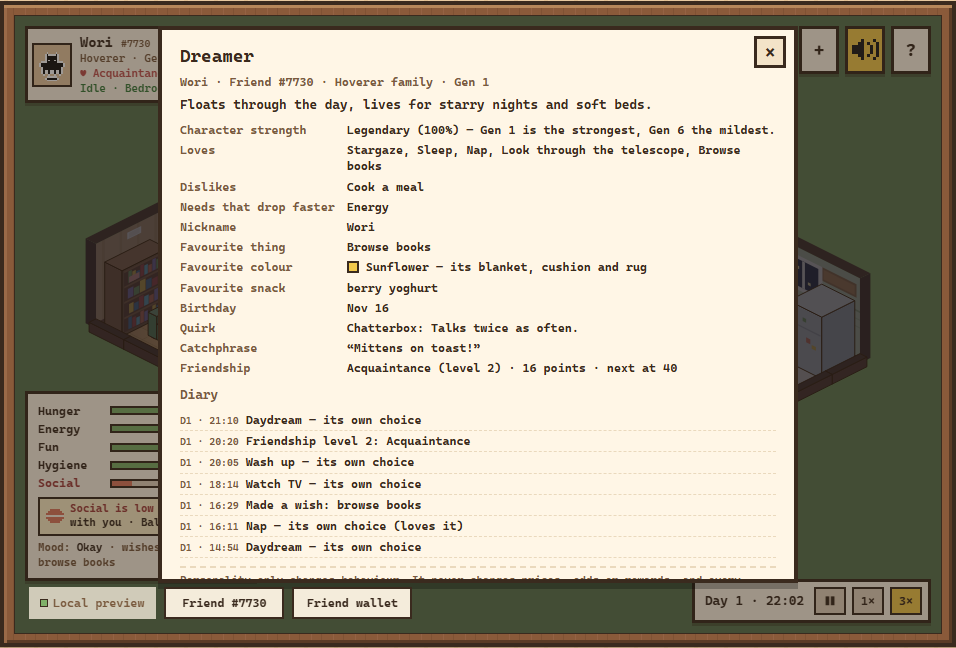
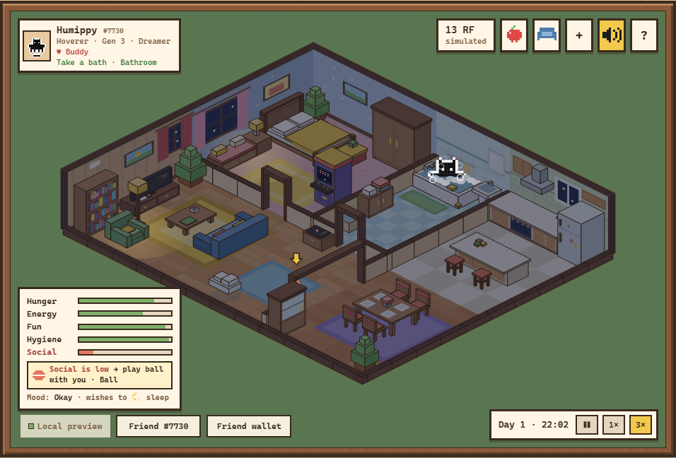
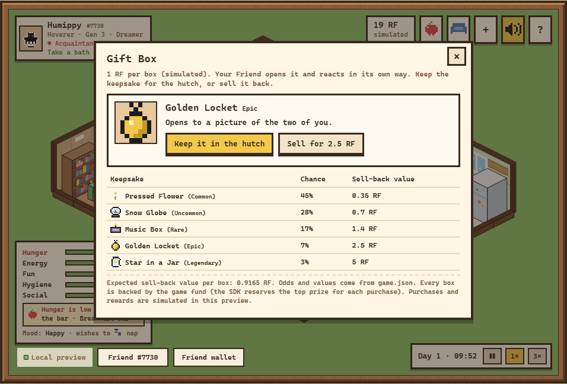
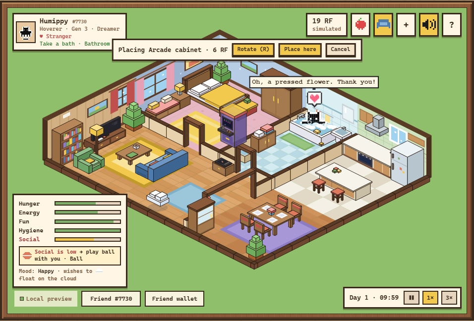
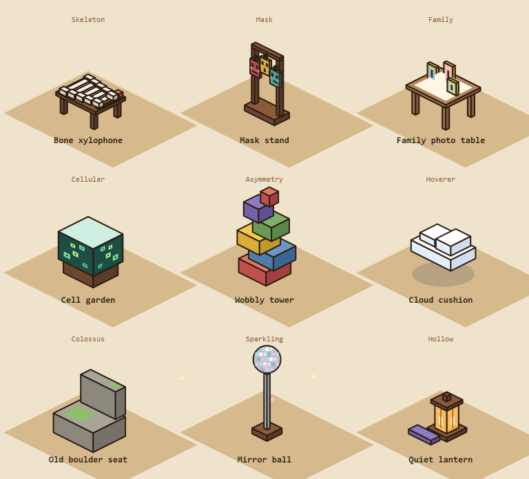
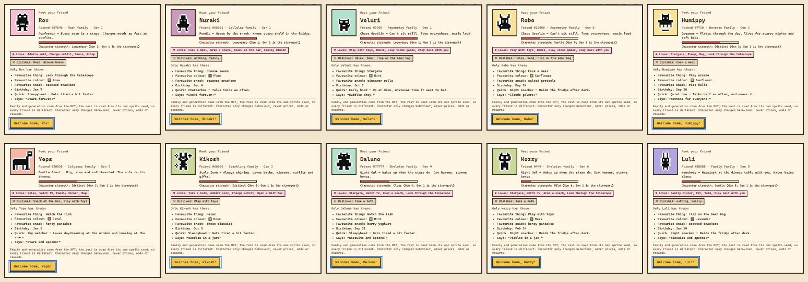

# Rare Friends: Friend Nook

A cozy isometric life sim starring **your** Rare Friend, built with FriendSDK v0.1.2 for the
[Rare Friends Vibeathon](https://github.com/spokesz/rarefriends-vibeathon) (category: Character Spotlight).

🕹️ **Play: https://dedq3e.github.io/rare-friends-nook/** (simulated economy)

🎬 **Demo with sound (47 s):** recorded from the real SDK runtime with Sparkling Friend #66666 read live from mainnet (only the wallet is mocked; `tests/video.mjs`). [File](media/friend-nook.webm).

https://github.com/user-attachments/assets/ba8e0824-cde9-49f6-81cb-2066e2926d94



Your Friend moves into a little pixel house and lives in it like a Sim. Everything it does by itself comes from
the NFT: its **family** sets its temperament (loves, dislikes, voice, how it moves), its **generation** how strong
that character is, and its own **sprite seed** a nickname, a favourite colour, a favourite activity, a favourite
snack, a birthday, a catchphrase and a quirk that no other Friend has.

| | |
|---|---|
|  |  |
|  |  |
|  |  |

## What's in it

- **The house:** 12 × 10 tiles, five rooms, cut-away walls, day and night, 31 activities on furniture that
  animates while it's used (TV channels and a video game, swimming fish, a turning record, a sizzling pan).
- **The Friend:** its canonical Generations frames in four facings, never recoloured, rotated or reshaped;
  clothes fitted to its own silhouette. Needs (hunger, energy, fun, hygiene, social), free will, wishes,
  refusals, a diary of its own choices, friendship levels, a family voice, a signature idle.
- **Family heirlooms:** nine family heirlooms, one per family, move in with the Friend (a bone xylophone for a
  Skeleton, a cloud cushion for a Hoverer, a mirror ball for a Sparkling…), each with an activity its family loves.
- **Hints:** the lowest need, and one thing in the house that raises it, with an arrow and a one-tap button.
- **Sound:** a composed soundtrack for each time of day (marimba morning, vibraphone-and-Rhodes swing, lo-fi
  evening with vinyl crackle, a music-box lullaby in 3/4) and a disco record to dance to, a sound for every activity,
  footsteps by floor, finches, an owl; all synthesized with Web Audio.
- **Economy (simulated):** Gift Box on the SDK chance game (1 RF, five keepsakes worth 0.9165 RF on average when
  sold back), food, clothes and Buy-mode furniture as RF sinks. Details in [submission/README.md](submission/README.md).



## Ten real Friends

`node tests/friends.mjs` plays ten real Generations Friends (eight families, generations 1 to 6) through the real
SDK runtime, their artwork, family, seed and generation read live from Robinhood mainnet. Same house, ten characters:



The full table (what each chose by itself) is in [submission/README.md](submission/README.md#ten-real-friends-ten-characters).

## Controls

Click or tap furniture to pick an action, click the floor to walk. Arrows / WASD walk, `E` uses the nearest
thing, `F` talks to your Friend, `Esc` closes. The camera button makes a random meme about your Friend (one of fifteen meme templates). In Buy mode: arrows move the piece, `R` rotates, `Enter` places.
Time: pause, 1× (a day lasts 8 minutes), 3×. Settings (`?`): volume, music, reduced motion.

## Requirements

A browser wallet connected to **Robinhood mainnet (chain 4663)** holding a hardwired Rare Friends Generations
NFT (generation 1 or higher). The SDK runtime handles the wallet, Friend selection and the ownership gate. On a
phone, open the preview in the wallet app's browser and turn the phone sideways.

## Run it

```
npm ci
npm run dev        # local dev server with the SDK runtime
npm run build      # static build into docs/ (GitHub Pages)
```

On Windows, `play.bat` serves the prebuilt `docs/` on http://localhost:4183.

## Checks

```
npm run typecheck
npm run check      # friendsdk check
npm test           # friendsdk test
npm run docs       # every number in the docs matches game.json and the code
```

Browser checks (need `npm install --no-save playwright` and `npx playwright install chromium`):
`node tests/interact.mjs`, `gift.mjs`, `buy.mjs`, `fx.mjs`, `bath.mjs`, `audio.mjs`, `life.mjs`, `phone.mjs`, `perf.mjs`.
Real Friends read live from mainnet: `node tests/friends.mjs` (also needs `pngjs`). Music to WAV: `node tests/music.mjs`.
Demo video with sound: `node tests/video.mjs` (Microsoft Edge). README media: `node tests/media.mjs` (also needs `gifenc` and `pngjs`); the heirloom sheet: `node tests/heirlooms.mjs`.

## Layout

`games/friend-nook/`: `index.tsx` (React adapter and UI), `engine.ts` (camera, rendering, walking, free will),
`iso.ts` (projection and depth sorting), `house.ts`, `furniture.ts`, `catalog.ts`, `fx.ts` (living furniture),
`sim.ts` (needs and actions), `personality.ts` (families), `traits.ts` (per-token traits), `heirlooms.ts` (family
heirlooms), `audio.ts`,
`keepsakes.ts`, `art.ts`, `wardrobe.ts` + `fit.ts` (clothes fitted to any Friend), `game.json` (Gift Box odds).
Design notes: [DESIGN.md](DESIGN.md).

## Known limitations

The SDK sandbox has no storage, so a reload starts a fresh house. Purchases and rewards are simulated. Sound
starts after the first click or key press.

## License

Apache-2.0. FriendSDK and the Rare Friends artwork belong to Rare Friends.
