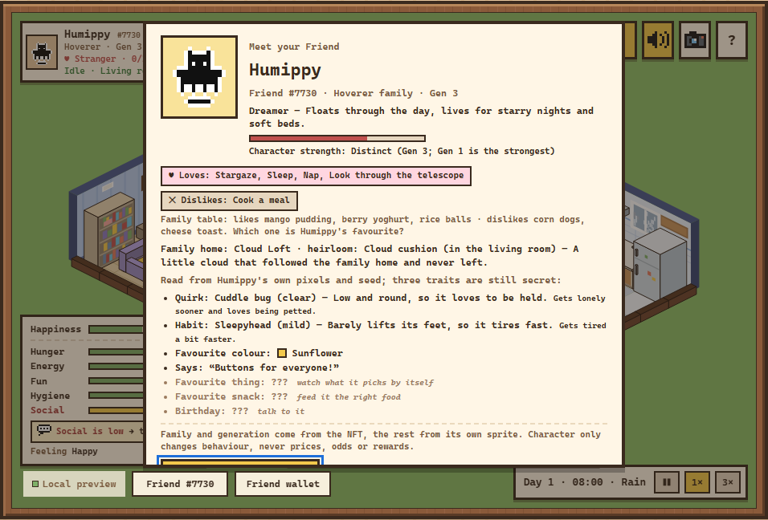
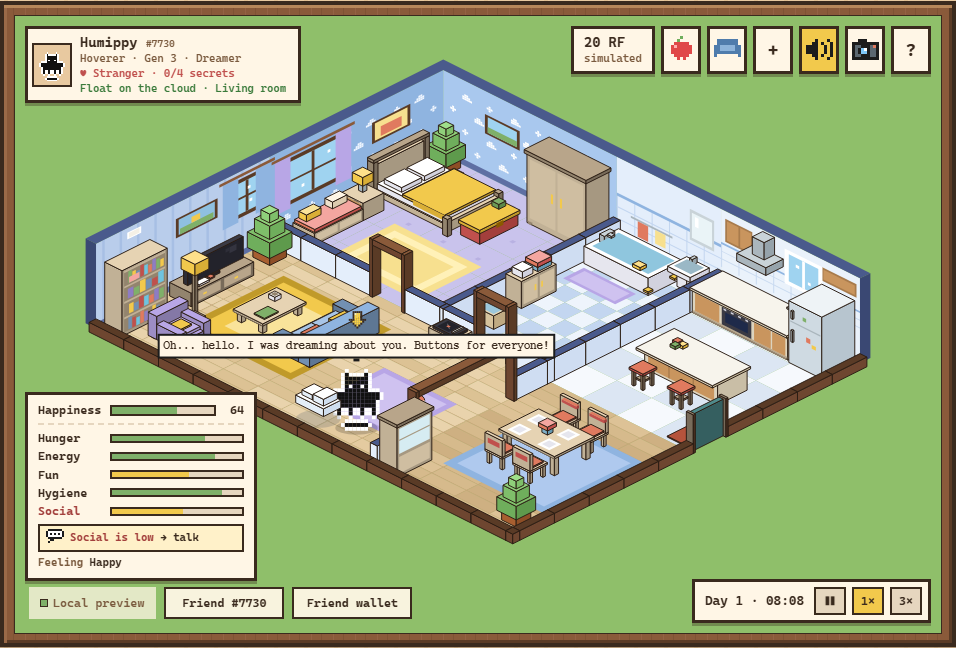
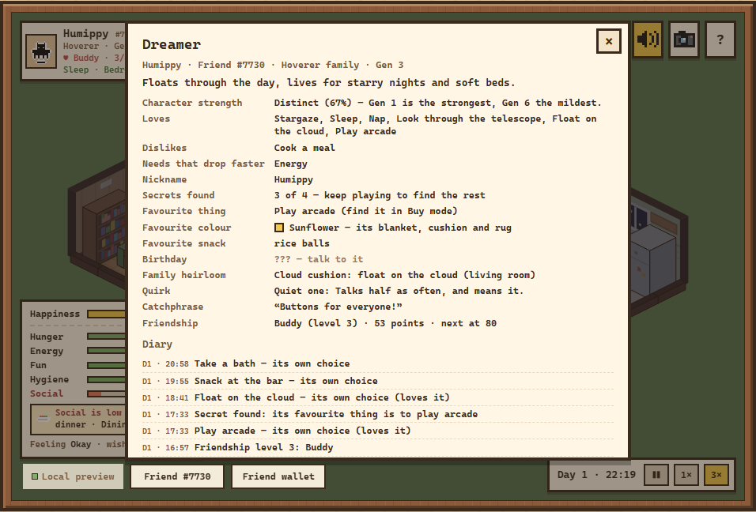
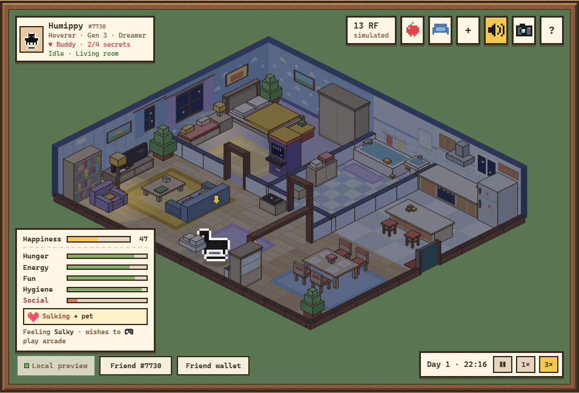
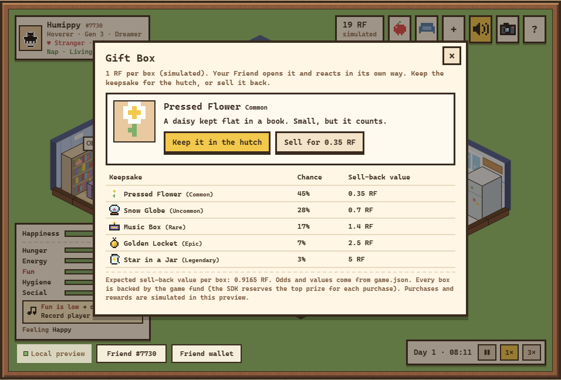
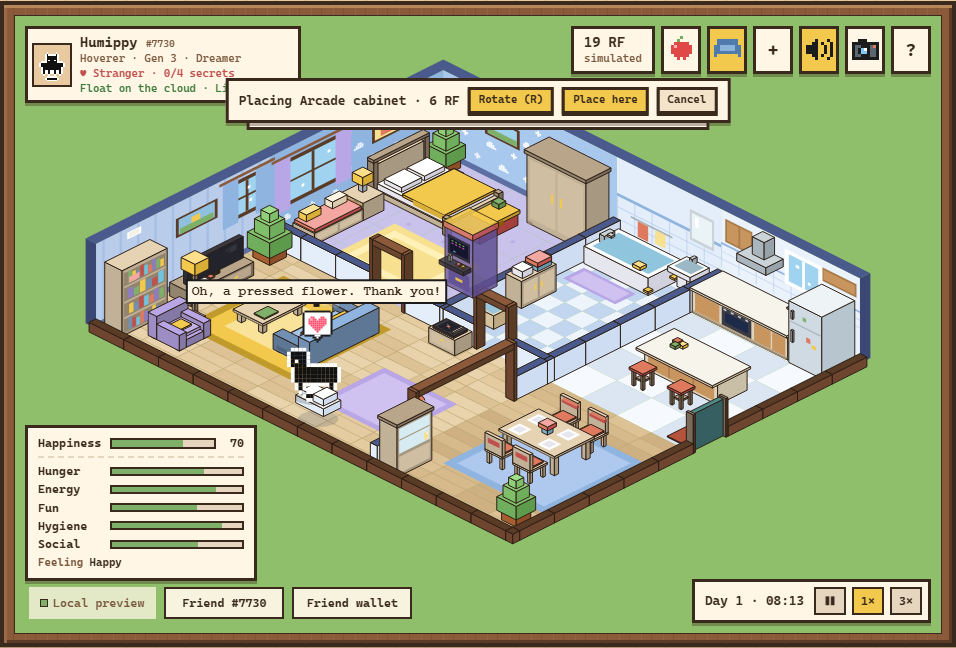
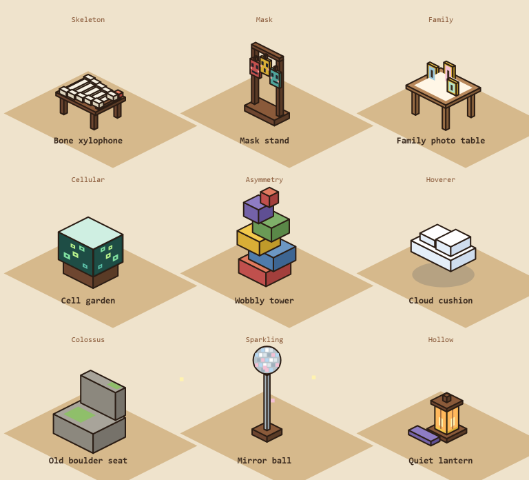
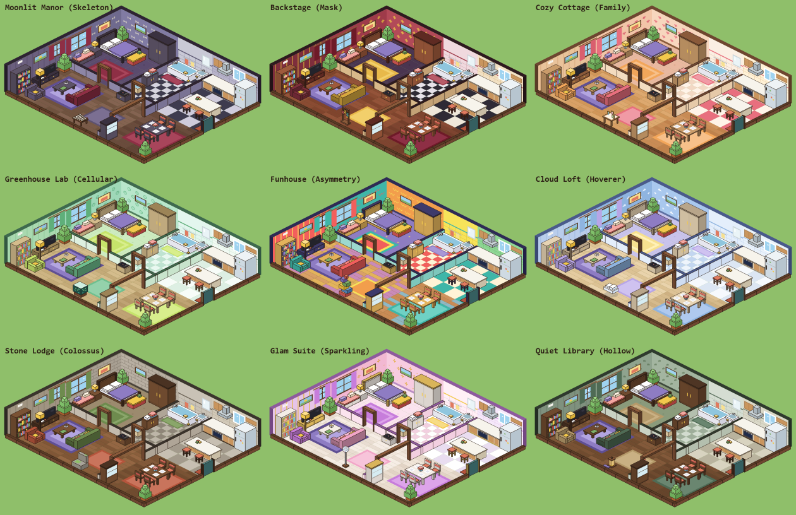
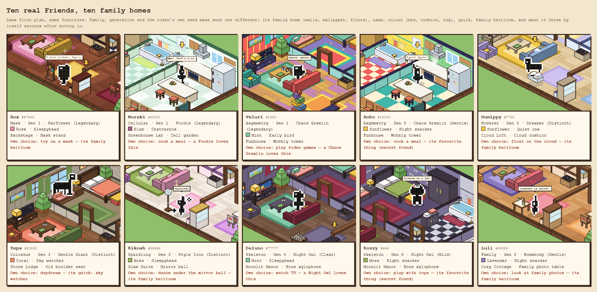

# Rare Friends: Friend Nook

A cozy isometric life sim starring **your** Rare Friend, built with FriendSDK v0.1.4 for the
[Rare Friends Vibeathon](https://github.com/spokesz/rarefriends-vibeathon) (category: Character Spotlight).

🕹️ **Play: https://dedq3e.github.io/rare-friends-nook/** (simulated economy)

🎬 **Demo with sound (62 s):** recorded from the real SDK runtime with Sparkling Friend #66666 read live from mainnet (only the wallet is mocked; `tests/video.mjs`, MP4 in `media/`).

https://github.com/user-attachments/assets/3081a86d-9c9d-491c-8f63-ebbe96be1ca4


Your Friend moves into a little pixel house and lives in it like a Sim. Everything it does by itself comes from
the NFT: its **family** sets its temperament (loves, dislikes, voice, how it moves), its **generation** how strong
that character is, and its own **sprite seed** a nickname, a favourite colour, a favourite activity, a favourite
snack, a birthday and a catchphrase, and quirks read from the shape of its own pixels.

| | |
|---|---|
|  |  |
|  |  |
|  |  |

## What's in it

- **The house:** 12 × 10 tiles, five rooms, cut-away walls, day and night, 34 activities on furniture that
  animates while it's used (TV channels and a video game, swimming fish, a turning record, a sizzling pan).
- **The Friend:** its canonical Generations frames in four facings, never recoloured, rotated or reshaped;
  clothes fitted to its own silhouette. Needs (hunger, energy, fun, hygiene, social), free will, wishes,
  refusals, a diary of its own choices, friendship levels, a family voice, a signature idle.
- **Family heirlooms:** nine family heirlooms, one per family, move in with the Friend (a bone xylophone for a
  Skeleton, a cloud cushion for a Hoverer, a mirror ball for a Sparkling…), each with an activity its family loves.
- **Family homes:** the family also decorates the house: nine homes on the same floor plan, each with its own walls,
  wallpaper motif, floors, curtains, rugs and furniture materials (Moonlit Manor with bone wallpaper and black-lacquer
  furniture for a Skeleton, Cloud Loft with clouds and stars for a Hoverer, Stone Lodge in dark oak for a Colossus…).
  Only looks change: the same pieces in the same places, with the same activities and prices.
- **Hints:** the lowest need, and one thing in the house that raises it, with an arrow and a one-tap button.
- **Home comfort:** pieces with an activity it loves make its needs drop slower, ones it dislikes faster (it grumbles
  about them); neighbours remember your last visit, a good one fills its need for company, and the street names your best friend (panel and day recap).
- **Weather:** clear, cloudy, rain, snow or a storm in the windows, changing every few in-game hours; the whole street
  shares it, so a neighbour's windows show the same sky.
- **Sound:** a composed soundtrack for each time of day (marimba morning, vibraphone-and-Rhodes swing, lo-fi
  evening with vinyl crackle, a music-box lullaby in 3/4) and a disco record to dance to, a sound for every activity,
  footsteps by floor, finches, an owl; all synthesized with Web Audio.
- **Economy (simulated):** Gift Box on the SDK chance game (1 RF, five keepsakes worth 0.9165 RF on average when
  sold back), food, clothes and Buy-mode furniture as RF sinks. The RF prices are example values on the scale of the
  SDK's reference games (1 RF per consumable, about 0.90 RF back on average); to price higher, multiply every price
  and keepsake value by the same factor, which keeps the odds, the 91.65% return and the balance. Details in [submission/README.md](submission/README.md).





## Ten real Friends

`node tests/friends.mjs` plays ten real Generations Friends (eight families, generations 1 to 6) through the real
SDK runtime, their artwork, family, seed and generation read live from Robinhood mainnet. Same floor plan, ten family
homes and ten characters, each at its first own choice:



The full table (what each chose by itself) is in [submission/README.md](submission/README.md#ten-real-friends-ten-characters).

## Controls

Click or tap furniture to pick an action, click the floor to walk. Arrows / WASD walk, `E` uses the nearest
thing, `F` talks to your Friend, `Esc` closes. The front door visits a neighbour's whole house: real Generations Friends from a recorded snapshot, played by the game, so every visit is simulated. The camera button makes a random meme about your Friend (one of twenty-one meme templates). In Buy mode: arrows move the piece, `R` rotates, `Enter` places.
Time: pause, 1× (a day lasts 8 minutes), 3×. Settings (`?`): volume, music, reduced motion.

## Requirements

A browser wallet connected to **Robinhood mainnet (chain 4663)** holding a hardwired Rare Friends Generations
NFT (generation 1 or higher). The SDK runtime handles the wallet, Friend selection and the ownership gate. On a
phone, open the preview in the wallet app's browser and turn the phone sideways.

## Run it

```
npm ci
npm run dev        # local dev server with the SDK runtime
npm run build      # static build into tmp/pages, copied into docs/ (GitHub Pages)
```

On Windows, `play.bat` serves the prebuilt `docs/` on http://localhost:4183.

## Checks

```
npm run typecheck
npm run check      # friendsdk check
npm test           # friendsdk test (needs Playwright, below)
npm run docs       # every number in the docs matches game.json and the code
```

`npm test` and the browser checks need `npm install --no-save playwright` and `npx playwright install chromium`. Browser checks:
`node tests/interact.mjs`, `gift.mjs`, `buy.mjs`, `fx.mjs`, `bath.mjs`, `audio.mjs`, `life.mjs`, `phone.mjs`, `perf.mjs`,
`onboarding.mjs` (the first own choice), `day.mjs` (secrets and the recap), `sulk.mjs`, `visit.mjs` (the street and a simulated visit), `treats.mjs` (special treat, birthday cake, where your RF went). Unit checks: `npm run pixels` (quirks from pixels), `npm run street` (who lives on the street), `npm run ledger` (the RF split),
`meme.mjs` (also needs `pngjs`). Real Friends read live from mainnet: `node tests/friends.mjs`. Music to WAV: `node tests/music.mjs`.
Demo video with sound: `node tests/video.mjs` (Microsoft Edge). The game is also checked by hand on the published build with a real wallet on Robinhood mainnet (computer and phone); the special treat, birthday cake and RF panel came after that run and are covered by the browser tests.
README media: `node tests/media.mjs`; the heirloom sheet: `node tests/heirlooms.mjs`; the family homes: `node tests/homes.mjs` (both also need `pngjs`).

## Layout

`games/friend-nook/`: `index.tsx` (React adapter and UI), `engine.ts` (camera, rendering, walking, free will),
`iso.ts` (projection and depth sorting), `house.ts`, `furniture.ts`, `catalog.ts`, `fx.ts` (living furniture),
`sim.ts` (needs and actions), `personality.ts` (families), `traits.ts` (per-token traits), `heirlooms.ts` (family
heirlooms), `homes.ts` (family homes), `memes.ts` (meme mode), `neighbours.ts` + `visit.ts` (simulated neighbours), `audio.ts`,
`keepsakes.ts`, `art.ts`, `wardrobe.ts` + `fit.ts` (clothes fitted to any Friend), `game.json` (Gift Box odds).
Design notes: [DESIGN.md](DESIGN.md).

## Known limitations

The SDK sandbox has no storage, so a reload starts a fresh house. Purchases and rewards are simulated. Sound
starts after the first click or key press.

## License

Apache-2.0. FriendSDK and the Rare Friends artwork belong to Rare Friends.
